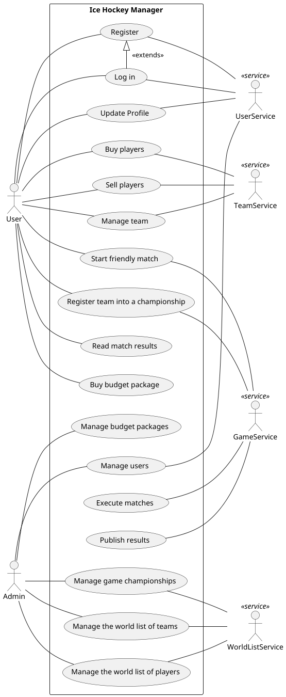
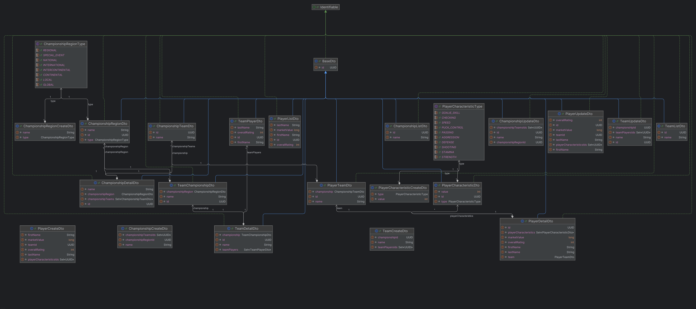
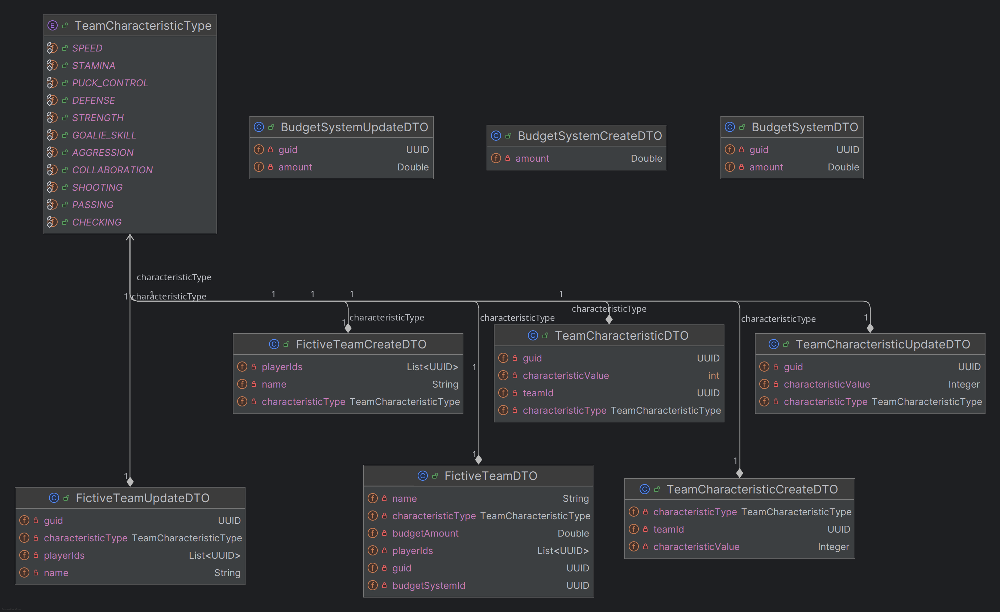
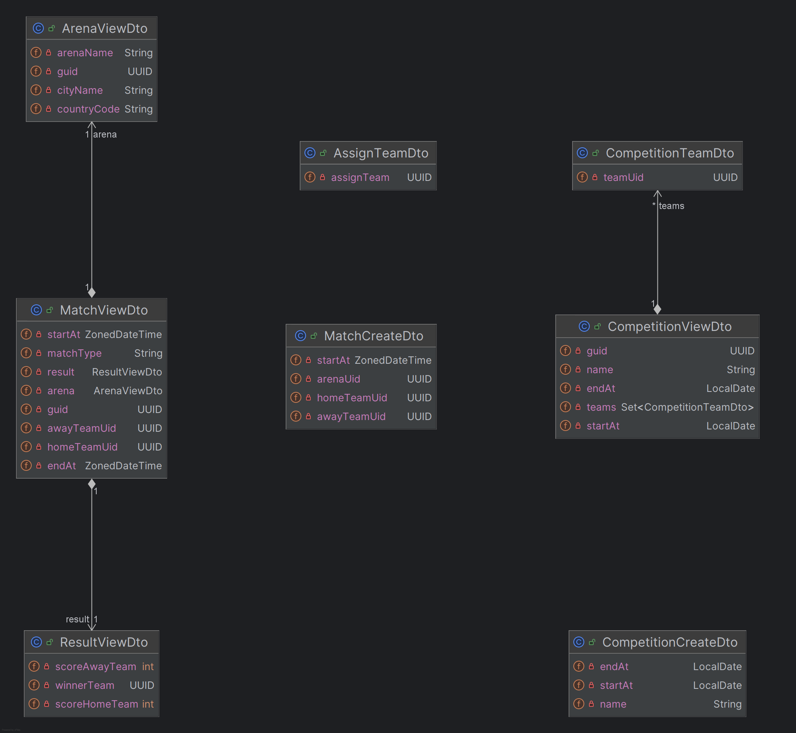
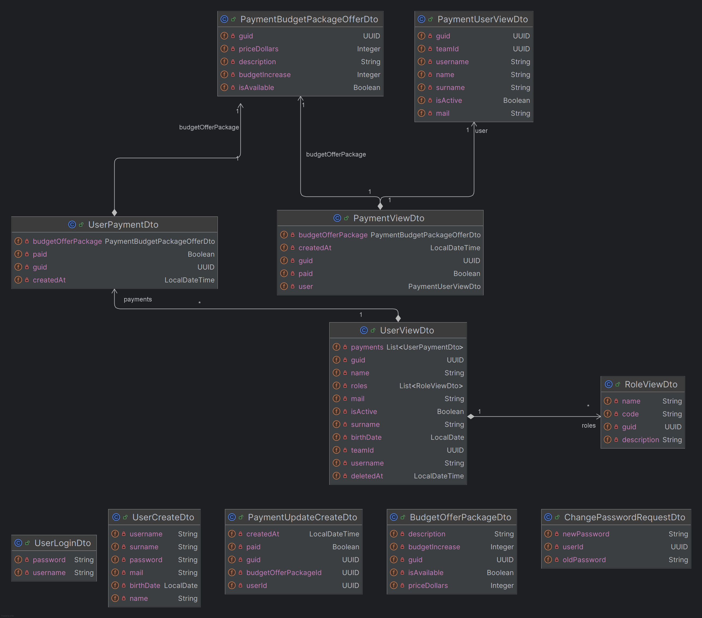

# Ice Hockey Manager

Several human players can manage their hockey teams out of a list of real ice hockey teams of several
championships across Europe. Human players can pick their team and add / remove ice hockey players from a list of
available free agents. There is a schedule of games and results will be generated taking into account the players
characteristics (no need to have some advanced algorithm simulating games: just a simple randomization will do it!).
Admin can put new hockey players in the main list of free agents and change their attributes before they are selected by
other human players. If you want, you can implement a budget system for each team, so that players can be bought and
sold based on the financial availability of teams.

## How to run

### Prerequisites

Before you begin, ensure you have the following installed:

- **Java Development Kit (JDK) 21** — Required for building and running the services.
- **Apache Maven 3.8.8+** — Used for building and managing dependencies.
- **Docker** — To run the services in containers using Docker Compose.

You can check your installations with:
```bash
java --version
mvn --version
docker --version
```

### Run locally

How to run each service separately:

1. Run `mvn clean install` in the root directory.
2. Then for each service, go to its sub-folder (e.g. `cd game-service`) and use `mvn spring-boot:run`.

**WARNING** - To properly use the user-service, you need to run the Artemis broker yourself and correctly define its URL to match the user-service configuration (`spring.artemis.broker-url: tcp://artemis:61616`). If you decide to run the service with Docker, the Artemis broker will be started automatically. Without running the Artemis broker, payment methods may not function correctly when creating or updating.

### Run in Docker

Run following command in the terminal:

```bash
docker compose up -d
```

## Swagger

You can access Swagger UI at following path:
```http://localhost:<service-port>/api```

## How to test authentication

1. Run [oauth client](/oauth-client) in Docker or using `mvn spring-boot:run`
2. Go to `http://localhost:8084` - login page should appear
3. Login using MUNI provider with your credentials
4. After login, you should be redirected to the `/token` page, where you can find your `Bearer` JWT token
5. Go to the Swagger UI of desired service. In the upper right corner, click on the green `Authorize`. Insert your JWT
   into the popup.
6. Run request - `Bearer` token should be automatically applied to the `Authorization` header.


## Grafana

You can access grafana UI at the following path (if ran by docker):

```http://localhost:3000/```

As credentials, use the default ones ;)

## Showcase

We prepared showcase using `locust.io`. The showcase shows complete workflow - choosing the players, creation of fictive
teams and running the friendly match. After the match, the winning team receives a reward to its budget (or both in case
of draw).

You must have installed Docker on your system. We prepared Docker image, so the Python version is the same on all
devices.

**Make sure all the micro-services are running with the newest build** - see [Run in Docker](#run-in-docker)
or [Run locally](#run-locally)

Please follow these steps to run:

1. Go to `e2e/locust` folder

```bash
cd e2e/locust
```

2. Build Docker image

```bash
docker build -t showcase .
```

3. Run the Docker image. Instead of `<oauth2_token>`, please insert your OAuth2 token obtained
   via [oauth client](/oauth-client) -
   see [How to test authentication](#how-to-test-authentication)

```bash
docker run -it --rm showcase <oauth2_token>
```

## Microservices

### 1. Word List Service

> Responsible person: Matej Keznikl

World List service takes care about the list of the real ice hockey teams. User can see player characteristics,
information about championship where the player and its team belongs. There are multiple types of the
championships (International, Continental, National, ...). Users can choose players listed in this service into his
team.

### 2. Team Service

> Responsible person: Jan Martinek

Team Service cares about the managing user's fictive teams. It means, when the user chooses (buys) player from the
world list, then the player becomes managed by the Team service. It cares about grouping players into the teams, which
can then register and participate in the competitions. The service also takes care about the budget of the team,
so then users can buy or sell the players. Teams earn money from the won competitions.

### 3. Game Service

> Responsible person: Martin Procházka

Game Service takes care about the competitions and matches. Admin can create competitions, where the team can
participate.
Team registers into the competitions. For each competition, the matches can be generated within the defined timeframe of
the competition. When the matches are created, they are automatically started at the defined time. The result of the
match
is done by randomization and takes teams characteristics into account (in the next Milestone). Other services are
informed
about the finished match and the result. User can also create friendly match between two teams.

### 4. User service

> Responsible person: Jakub Dvořák

User Service takes care about users (players). User can create and manage his account. He can also buy Budget offer
packages, which gives user extended initial budget for buying players and composing his teams. If user is admin, he
can also manage budget package offers.

#### How to promote yourself to admin
Because only admin can manage budget pacakage offers and admins, you need to be admin to check all endpoints. To do so: 
1. Authorize and paste your bearer token to swagger. You can obtain the token here [oauth client](/oauth-client).

2. Register your self as a user in user-service (on [swagger](http://localhost:8083/api/swagger-ui/index.html#/User%20API/registerUser)). And copy returned guid to clipboard.

3. Kill the user-service

4. Open `./user-service/src/main/resources/application.yaml` and at the end of the file, there is prepared setting which will make you admin after application start. Just insert your guid into this section:
```Yaml
user-service:
  promote-to-admin-id: <your guid - in file this is empty in default>
```


## Use case diagram



## Class diagram for the DTOs

### World List Service



### Team Service



### Game Service



### User Service



# GenAI usage

## Game service

- Gen AI was used for generating random data for database seeders.

## User service
Gen AI was used for:
- generating some test cases of controller unit tests, but had to be adjusted.
- genarating methods to seed userHasRole and Payment tables